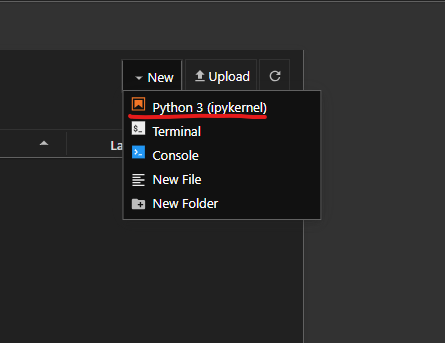
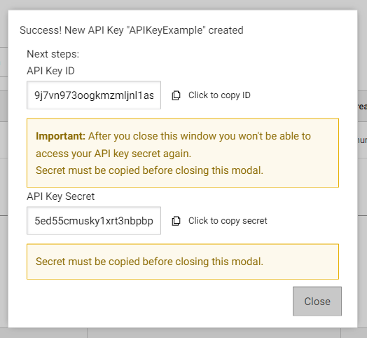

# Open Data Week 2024

## Step 1: Anaconda and Jupyter Notebook download instructions

Python is the programming language we use to prepare data for and create our [Open Datasets](https://data.ny.gov/) on our Socrata platform, and what you'll use in this demonstration. Anaconda is a 'distribution' of Python. Downloading Anaconda lets you use Python, as well as other useful programs for programming in Python.

1. Download this repository by clicking the "Code" button, and then the "Download Zip" button beneath that.<br>


2. Extract the `open-data-week-2024` folder to somewhere in your computer by clicking or double-clicking it, and hitting the "Extract All" button.<br>


3. Go to [this link](https://www.anaconda.com/products/distribution) and download Anaconda.

4. If you go to the Downloads folder on your computer, you should see the Anaconda installer there. It should look something like this:<br>


_Double click on that, and then you’ll be prompted through a number of steps to install Anaconda on your computer. Go through all of the steps until the installation is complete._

5. Once you finish Step 2, Anaconda will be downloaded on your computer.  The icon for the app will look like this:<br>


_Open the application._

6. Once you open Anaconda-Navigator, the interface should look similar to this:<br>


7. Click on “Launch” under the VS Code square. VS Code is a code-editor that we'll use to edit and run our Python scripts.<br>


It should pop up a new window like this:<br>


8. Click on Open Folder. Then navigate to the `open-data-week-2024` file in the folder, click on the folder named , and click "select folder." <br>


_This will set this folder as your workspace. You should be able to see what files are available in this folder on the left-hand side of your screen._<br>


9. VSCode has extensions that make programming using Python easier. You can install extensions by clicking on the "Extensions" button on the left hand side.<br>


_You should search for and install the following extensions:_

 - _Python_
 - _Jupyter_

## Step 2: Alternative for experienced Python users: Installing Jupyter with pip/pip3

As an existing Python user, you may wish to install Jupyter using Python’s package manager, pip, instead of Anaconda.

***The launch methods on Windows and Mac are different.***

### Windows launch Jupyter Notebook server steps
1. Navigate to the working folder you want to write or run Jupyter Notebook file. And on the address bar on the top, enter `cmd` and hit `Enter`.
    <br><br>
2. Then type `pip install jupyter` in the command prompt (in case you don't know where to run the pip instruction last step).
    <br><br>
3. After the successful installation, type `jupyter notebook` and hit `Enter`.
    <br><br>

### Mac OS launch Jupyter Notebook server steps
1. Open terminal in the working file and type `pip3 install jupyter`.
    <br><br>
2. Instead, you should type `python3 -m notebook` to lauch the Jupyter Notebook server successfully.
    <br><br>

_When successful, this will print some information about the notebook server in your terminal, including the URL of the web application (by default, http://localhost:8888):_
```bash
[I 2024-03-06 18:37:47.801 ServerApp] jupyter_lsp | extension was successfully linked.
[I 2024-03-06 18:37:47.806 ServerApp] jupyter_server_terminals | extension was successfully linked.
[I 2024-03-06 18:37:47.811 ServerApp] jupyterlab | extension was successfully linked.
[I 2024-03-06 18:37:47.814 ServerApp] notebook | extension was successfully linked.
[I 2024-03-06 18:37:48.416 ServerApp] notebook_shim | extension was successfully linked.
[I 2024-03-06 18:37:48.590 ServerApp] notebook_shim | extension was successfully loaded.
[I 2024-03-06 18:37:48.592 ServerApp] jupyter_lsp | extension was successfully loaded.
[I 2024-03-06 18:37:48.593 ServerApp] jupyter_server_terminals | extension was successfully loaded.
```

_When the notebook opens in your default web browser, you will see the Notebook Dashboard, which will show a list of the notebooks, files, and subdirectories in the directory where the notebook server was started. Most of the time, you will wish to start a notebook server in the highest level directory containing notebooks. Often this will be your home directory._<br>


## Step 3: Install packages in Jupyter Notebook steps

1. Create an `ipynb` file.<br>
    <br><br>
2. Rename the file.<br>
    <br>
    <br><br>
3. In the cell, use `!pip list` to check all packages installed. **Exclamation Mark** required!<br>
    <br><br>
4. For example, install `pandas` package. Use `!pip install pandas`.<br>
    <br><br>
5. Check installation by using `!pip show pandas`.<br>
    <br><br>

## Step 4: Proxy setup steps

### Config proxy
If you are on a corporate network, you might need to define and use proxies to access the API. Your IT department should be able to provide proxies for you. Feel free to ask them.  

FYI, `local_config.py` file locates in the local repo `open-data-week-2024` that you just clone from [GitHub](https://github.com/nymta/Open-Data-Week-2024).<br>
    <br><br>

Now, in your `local_config.py` file, customize your proxy for variables `https` and `http`. The format should look like `domain:port`.

```python
https = "insertYourProxyHere"
http = "insertYourProxyHere"
```

## Step 5: NYS Data API setup steps

### Create an account
1. Go to [DATA.NY.GOV](https://data.ny.gov/signup) to signup if you don't have an account.<br>
    <br><br>
2. After verifying your email address, you can sign in and will be redirected to the dashboard.<br>
    <br><br>

### Config with your info
1. On the top-left corner, click the pencil icon.<br>
    <br><br>
2. Navigate to the sidebar on the left, click "Developer Settings".<br>
    <br><br>
3. Create New API Key.<br>
    <br><br>
    <br><br>
    <br><br>
4. Copy API Key ID and API Key Secret to `local_config.py` file. And replace it with your own API Key ID and API Key Secret.
```python
apikey_id = "yourAPIKeyID"
apikey_secret = "yourAPIKeySecret"
```
5. Create New App Token.<br>
    <br><br>
    <br><br>
    <br><br>
6. Copy App Token to `local_config.py` file and replace it with your own App Token.
```python
apptoken = "yourAppToken"
```
7. Unreveal App Secret Token by clicking `Show Secret Token` button. Copy it and replace the value of `apptoken_secrete` variable.
```python
apptoken_secret = "yourAppSecretToken"
```
